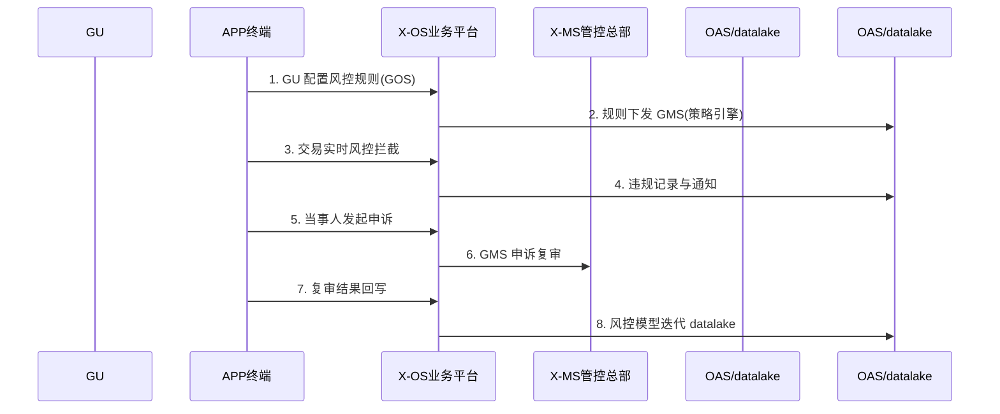

# SC-009 · 风控合规拦截申诉（标准范例）

> **视角**：职能/风控｜**主角角色**：`GU` ｜ **涉及平台**：GOS/GMS
> **对应 A1.1**：02_B 角色派生 / 03_B OS 十二平台 / 03_C MS 十二管理集座 / 03_D OAS 底座
> **格式**：标准范例（业务流 + 精简时序图 + 增量 DDL + 事件契约 + 一致性验证）

## 一、业务背景

监管角色(GU)通过 GOS 配置风控规则，GMS 实时拦截违规交易并支持申诉复审。

## 二、前置准备

- **角色**：`GU`（由四根身份 HU/EU/GU/OU 派生，戴帽机制见 SC-014）
- **数据**：复用通用表 `iam.tenants` / `iam.users`（见 `00_场景范例索引.md` 通用表清单），以下仅列**本场景增量表**
- **权限**：`tenant_id` 多租户隔离；跨 OS 调用经 XBUS 事件总线

## 三、关键流程步骤

| # | 步骤 | 参与者流向 |
|:--|:--|:--|
| 1 | GU 配置风控规则(GOS) |
| 2 | 规则下发 GMS(策略引擎) |
| 3 | 交易实时风控拦截 |
| 4 | 违规记录与通知 |
| 5 | 当事人发起申诉 |
| 6 | GMS 申诉复审 |
| 7 | 复审结果回写 |
| 8 | 风控模型迭代 datalake |

## 四、时序图（精简）

## 五、关键 API（RESTful）

| 方法 | 路径 | 说明 |
|:--|:--|:--|
| POST | `/api/{os}/...` | 创建类操作（写，走 Saga） |
| GET  | `/api/{os}/...` | 查询（同步 gRPC/HTTP） |
| POST | `/api/{ms}/...` | 管控规则/审批 |
| EVENT| `xbus.<事件类型>` | 跨 OS 异步事件（幂等） |

> 完整路径与字段见 `00_API_清单.md`（OpenAPI YAML）。

## 六、增量数据表 DDL

以下表为**本场景新增**，通用表（`iam.tenants`/`iam.users` 等）不重复定义：

- `gos.risk_rules`
- `gms.risk_events`
- `gms.appeals`
- `datalake.risk_metrics`

## 七、事件契约

复用统一事件类型（幂等键 = 事件类型 + 业务 ID，72h 超时，死信队列见 SC-013）：

`RuleCreated`, `RulePublished`, `RiskIntercepted`, `AppealSubmitted`, `AppealReviewed`

## 八、与 A1.1 一致性验证

| 验证点 | 结果 |
|:--|:--|
| X 在 OS、M 在 MS | ✅ 交互在 APP/OS，审核管控在 MS |
| 层间正交（APP 不经 MS）| ✅ 均经 OS 中转 |
| 单一权威源 | ✅ 每类数据仅一个 owner |
| 四根身份 / 戴帽 | ✅ 主角由根身份派生 |
| 跨 OS 协作经 XBUS | ✅ 多场景涉及（详见 SC-013）|
| EOS=供给运营 / EMS=供给管理 | ✅ 命名规范统一 |

## 九、一句话总结

> **风控合规拦截申诉** 场景完整走通了「职能/风控」下的角色→平台→管控→底座闭环，
验证了 A1.1 「GOS/GMS」协作的正确性与职责边界清晰性。
